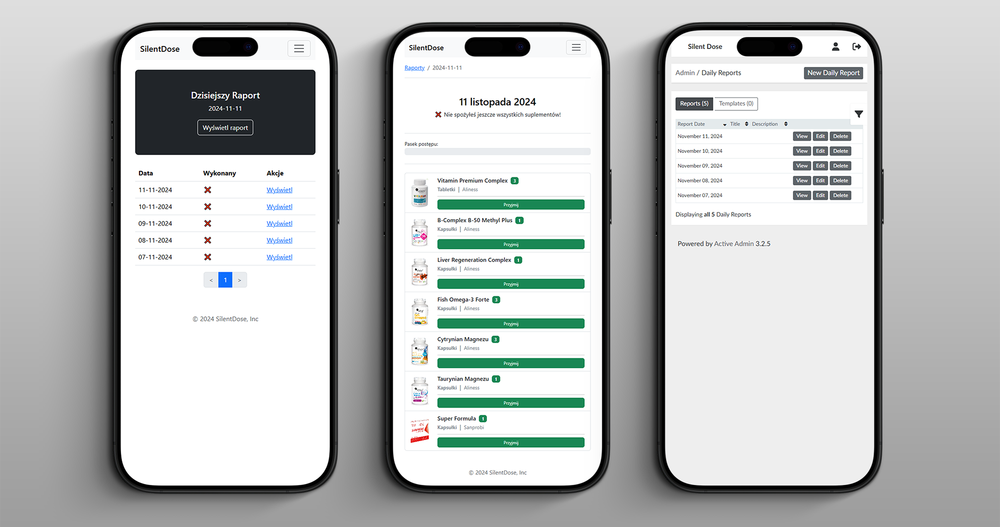

# Silent Dose

A simple Ruby on Rails app for tracking supplement intake, generating daily reports, and sending notifications to help users stay on top of their health routines. With a mobile-friendly interface and automatic daily summaries, it makes supplement management easy and efficient.

I am using this app by myself, and in my free time I am actively working on this project.

<p>
  
  
  
  
  
  
</p>



## Technologies

`Ruby 3.2.5`, `Rails 7.2`, `Hotwire`, `Docker`, `PostgreSQL`, `Redis`, `Sidekiq`, `Devise`, `Pundit`, `ActiveAdmin`.

## Features

- **Supplement Database**: A comprehensive list of supplements to be tracked.
- **Daily Report Generation**: Automatically creates a report at the start of each day.
- **Customizable Report Template**: Users can customize a report template from which daily reports are generated.
- **Automatic Daily Reports**: The app automatically creates a daily report for each user at the start of the day.
- **Email Notifications**: Sends email notifications about supplements already taken and those still pending.
- **Morning Summary**: Sends a summary email of the previous day’s supplement intake.
- **Mobile-Friendly Interface**: Simple, Bootstrap-based interface for mobile use, allowing users to check off supplements taken.
- **Background Jobs**: Handles background tasks like sending notifications and generating reports.
- **Hotwire Integration**: Uses Rails Hotwire for a responsive front-end experience.
- **Admin Panel**: Built-in admin panel for managing app data and users.

## Development

Install required Ruby version, I am using `chruby` and `ruby-install`.

Install gems:
```bash
bundle install
```

Run the development docker compose:
```bash
docker compose up -d --remove-orphans
```

Copy `.env.development.template` to `.env.development` and fill in the values.

Create the database, run the migrations and seed the database:
```bash
rails db:reset

# or

rails db:create
rails db:migrate
rails db:seed
```

Start the application:
```bash
./bin/dev
```

To create a demo user with credentials `demo@silentdose.com:password`, run the following command. If the user already exists, it will delete the user and recreate it:
```bash
rake db:create_demo_user
```

## Deploying to production with Docker Compose

I created and successfully deployed this application for personal use, and I will share the steps I took to deploy it—it's not difficult.

### VPS

Purchase any VPS server of your choice (Hetzner, DigitalOcean Droplet, etc.). In my case it was Hetzner Shared vCPU CCX23 (2 vCPU / 4GB RAM / 40GB SSD) with Ubuntu 24.04.1 LTS. Setup login with SSH keys.

#### ZSH

Install [ZSH](https://github.com/ohmyzsh/ohmyzsh/wiki/Installing-ZSH) and [Oh My Zsh](https://ohmyz.sh/):
```bash
# Install ZSH
sudo apt install zsh
chsh -s $(which zsh)

# Relogin to apply the changes and verify the shell
echo $SHELL
$SHELL --version

# Install Oh My Zsh
sh -c "$(curl -fsSL https://raw.githubusercontent.com/ohmyzsh/ohmyzsh/master/tools/install.sh)"
```

#### Docker

Install [Docker](https://docs.docker.com/engine/install/ubuntu/#install-using-the-repository):
```bash
# Uninstall all conflicting packages:
for pkg in docker.io docker-doc docker-compose docker-compose-v2 podman-docker containerd runc; do sudo apt-get remove $pkg; done

# Add Docker's official GPG key:
sudo apt-get update
sudo apt-get install ca-certificates curl
sudo install -m 0755 -d /etc/apt/keyrings
sudo curl -fsSL https://download.docker.com/linux/ubuntu/gpg -o /etc/apt/keyrings/docker.asc
sudo chmod a+r /etc/apt/keyrings/docker.asc

# Add the repository to Apt sources:
echo \
  "deb [arch=$(dpkg --print-architecture) signed-by=/etc/apt/keyrings/docker.asc] https://download.docker.com/linux/ubuntu \
  $(. /etc/os-release && echo "$VERSION_CODENAME") stable" | \
  sudo tee /etc/apt/sources.list.d/docker.list > /dev/null
sudo apt-get update

# Install Docker:
sudo apt-get install docker-ce docker-ce-cli containerd.io docker-buildx-plugin docker-compose-plugin
```

#### UFW Firewall

Install and configure `UFW`:
```bash
sudo apt install ufw
sudo ufw app list
sudo ufw allow 'Nginx Full'
sudo ufw allow OpenSSH
sudo ufw enable
sudo ufw status
```

#### CloudFlare

Login to CloudFlare (I am using it for DNS and SSL - but you can use any other service):
- Create in CloudFlare DNS a new `A` record with the server IP address.
- Enable Strict SSL/TLS encryption mode in CloudFlare.
- Go to `<domain name> > SSL/TLS > Origin Server > Create Certificate` and copy the certificate and key.
```bash
# Copy the certificate from cloudflare
sudo nano /etc/ssl/cert.pem

# Copy the key from cloudflare
sudo nano /etc/ssl/key.pem
```

I am using a certificate from Cloudflare for HTTPS because I want to prevent exposing the domain to the public (though it might still be exposed, and I could be mistaken—please correct me if that's the case!), unlike when using Let's Encrypt with Certbot.

#### Nginx Reverse Proxy

Install and configure Nginx:
```bash
sudo apt install nginx
```

Create a new file `/etc/nginx/sites-available/silent-dose` with the following content, replace `example.com` with your domain name.
```nginx
server {
    listen 80;
    listen [::]:80;
    server_name example.com www.example.com;
    return 301 https://$server_name$request_uri;
}

server {
    listen 443 ssl http2;
    listen [::]:443 ssl http2;
    ssl_certificate         /etc/ssl/cert.pem;
    ssl_certificate_key     /etc/ssl/key.pem;

    server_name example.com www.example.com;

    location / {
        proxy_pass http://localhost:3000;
        proxy_set_header Host $host;
        proxy_set_header X-Real-IP $remote_addr;
        proxy_set_header X-Forwarded-For $proxy_add_x_forwarded_for;
        proxy_set_header X-Forwarded-Proto $scheme;
    }
}
```

Configure Nginx:
```bash
# Remove the default configuration
rm /etc/nginx/sites-available/default
rm /etc/nginx/sites-enabled/default

# Test the configuration
sudo nginx -t

# Enable the new configuration
ln -s /etc/nginx/sites-available/silent-dose /etc/nginx/sites-enabled/

# Reload Nginx
sudo systemctl reload nginx

# Check the status
sudo systemctl status nginx
```

### Application setup

Clone the repository with the application.

Copy `.env.production.template` to `.env.production` and fill in the values.

Create the database:
```bash
docker compose -f docker-compose.prod.yml up -d db
docker compose -f docker-compose.prod.yml exec -it db bash
psql -U postgres
CREATE DATABASE "silent-dose_production";
docker compose -f docker-compose.prod.yml down
```

Start the application:
```bash
docker compose -f docker-compose.prod.yml build
docker compose -f docker-compose.prod.yml up -d --remove-orphans
```

Stop the application:
```bash
docker compose -f docker-compose.prod.yml down
```

With every new version of the application, you have to rebuild the image and restart the container.
```bash
git pull
docker compose -f docker-compose.prod.yml up -d --remove-orphans --build
```

Configure appropriate timezone in the system and in the `.env.production` file, to make sure that `cron` on OS and `sidekiq-cron` in the application are in sync:
```bash
timedatectl
timedatectl set-timezone Europe/Warsaw
```

## Backup and Restore the Database

### Manual Backup and Restore

To backup the database, use the following command on the running container:
```bash
docker compose -f docker-compose.prod.yml exec -it db pg_dump -U postgres silent-dose_production > pgdump-$(date +%F_%H-%M-%S).dump
```

To restore the database, use the following commands on the running container:
```bash
# Terminate all connections to the database, to make drop possible
docker compose exec -it db psql -U postgres -c "SELECT pg_terminate_backend(pid) FROM pg_stat_activity WHERE datname = 'silent-dose_production' AND pid != pg_backend_pid() AND leader_pid IS NULL;"
# Drop the database, must be in a separate command, because DROP DATABASE cannot be executed in a transaction block
docker compose exec -it db psql -U postgres -c "DROP DATABASE IF EXISTS \"silent-dose_production\";"
# Create a new database
docker compose exec -it db psql -U postgres -c "CREATE DATABASE \"silent-dose_production\" ENCODING UTF8;"
# Restore the database from the dump
docker compose -f docker-compose.prod.yml exec -T db bash -c "pg_restore -U postgres -v -d silent-dose_production" < pgdump.dump
```

### Backup and Restore

You can also use the `./db_backup.sh` and `./db_restore.sh` scripts to backup and restore the database.

If the scripts are not executable, make them executable:
```bash
chmod +x backup.sh restore.sh
```

Backup with `db_backup.sh` to current location:
```bash
./db_backup.sh
```

Backup with `db_backup.sh` to a specific location:
```bash
./db_backup.sh /path/to/backup
./db_backup.sh /backups
./db_backup.sh ..
```

Restore with `db_restore.sh` without arguments and with prompt:
```bash
./db_restore.sh
```

Restore with `db_restore.sh` using arguments:
```bash
./db_restore.sh my_database /path/to/backup-file.dump
```

### Automatic Database Backup with Cron

Install `cron`:
```bash
sudo apt update cron
sudo apt install cron
```

Check if `cron` is running:
```bash
sudo systemctl restart cron
sudo systemctl status cron
```

Create a backup directory:
```bash
mkdir /home/app/silent-dose_backups
```

Make `db_backup.sh` executable:
```bash
chmod +x db_backup.sh
```

Edit the crontab:
```bash
crontab -e
```

Add this line at the end of the file to backup the database every day at midnight (change the paths to match your setup):
```
0 0 * * * /home/app/silent-dose/db_backup.sh /home/app/silent-dose_backups
```

Verify content of the crontab:
```bash
crontab -l
```

The crontab will now automatically backup the database every day at midnight. Verify the backups:
```bash
ll /home/app/silent-dose_backups
```
